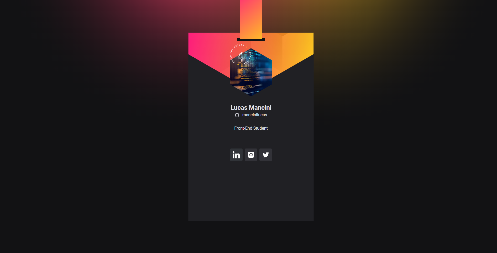

# nlw-heat

Solução desenvolvida na trilha Origin durante a [Next Level Week - Heat](https://nextlevelweek.com/).

## Table of contents

- [Overview](#overview)
  - [The challenge](#the-challenge)
  - [Screenshot](#screenshot)
- [My process](#my-process)
- [Built with](#built-with)
- [What I learned](#what-i-learned)

## Overview

### The challenge

Crachá produzido para a DoWhile com informações de usuário, GitHub e redes sociais.
Badge for DoWhile Event by Rocketseat with user information, GitHub and social media.

### Screenshot

### Links

- Solution URL: [Crachá DoWhile](https://mancinilucas.github.io/nlw-heat/)

## My process

### Built with

- Semantic HTML5 markup
- CSS custom properties
- Flexbox
- Grid
- Figma

### What I learned

Review of studied content such as:

- Semantic HTML5
- Flexbox
- Grid
- Figma
- DOM
- JavaScript functions
- API
- Desktop responsive design
